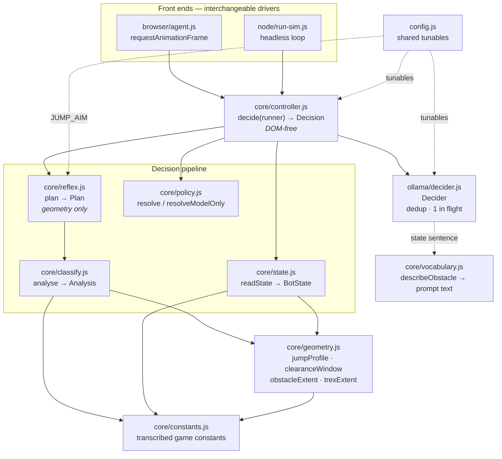
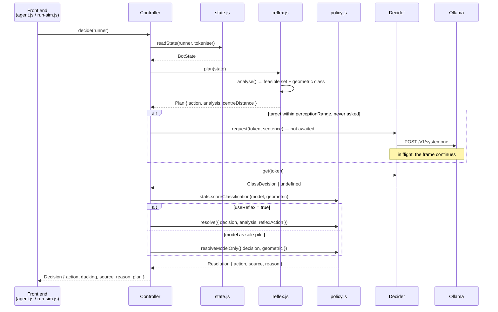
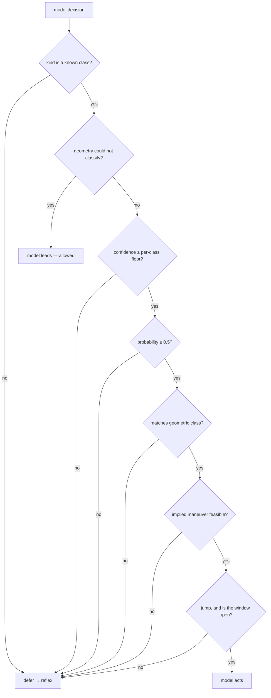
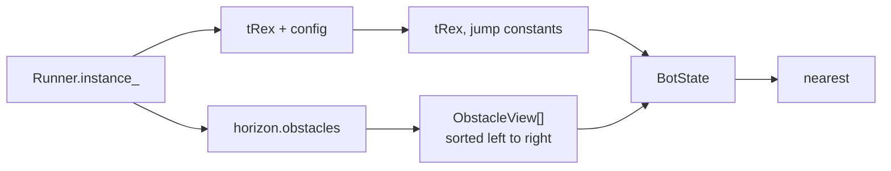
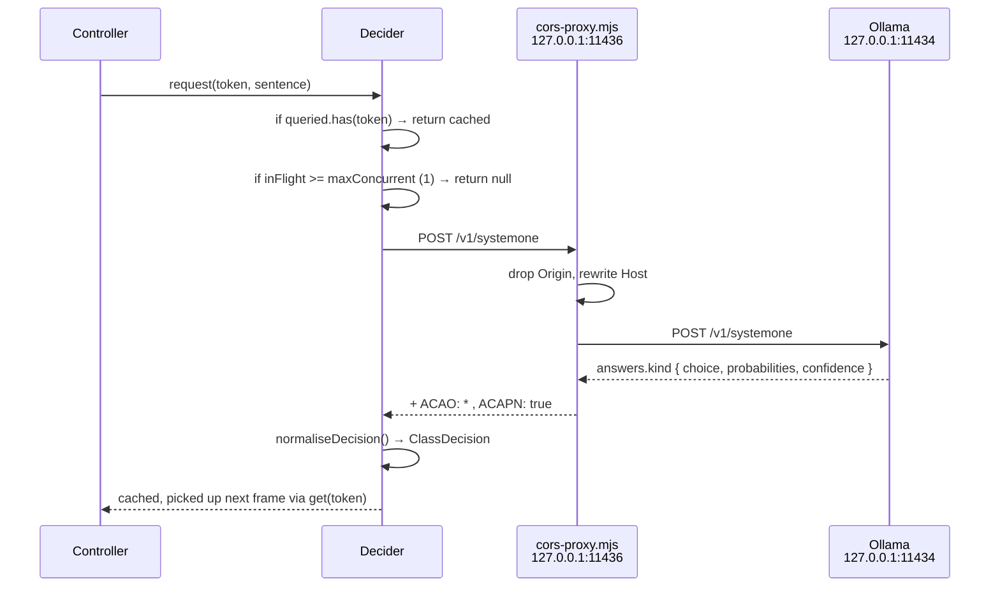
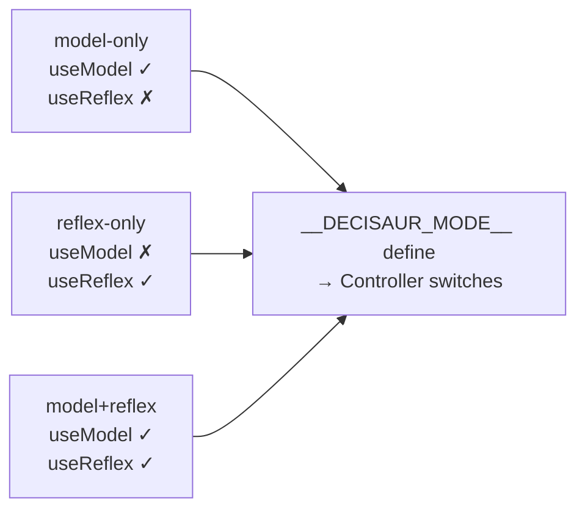
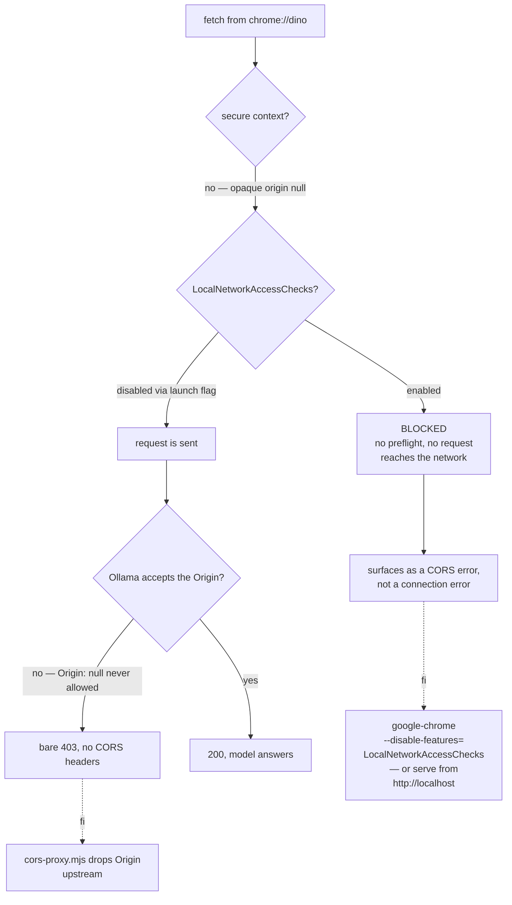
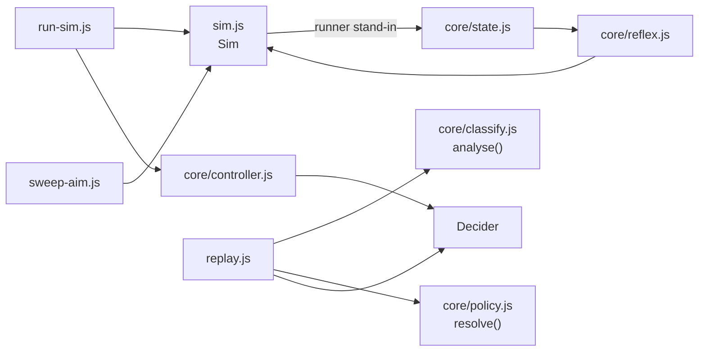

# Architecture

How decisaur is put together: the decision pipeline, what each module owns, and the
platform constraints the code is shaped around. For install and usage, see
[README.md](README.md).

---

## 1. The shape of it

Three layers, separated by what each is actually good at. The split is the whole
design — the model is a good *perceiver* and a poor *tactician*, so it is asked only
the question it answers well.

| Layer | Question it answers | Latency | Reference |
|---|---|---|---|
| **Model** — `src/ollama/decider.js` | what kind of obstacle is this? | 67-280ms | measured, 80% (32/40) |
| **Geometry** — `src/core/{classify,geometry,reflex}.js` | what can be done about it, and when? | ~0, per frame | exact |
| **Policy** — `src/core/policy.js` | is the model's opinion allowed to act? | ~0 | — |



**Why `controller.js` is DOM-free.** The browser agent and the headless simulator both
drive the same `Controller`. That is what lets `npm run sim` exercise the real decision
path rather than a reimplementation that can drift from it. The controller never
touches `document`, and neither does anything under `src/core/`.

---

## 2. One frame, end to end

`Controller.decide()` is synchronous and never awaits. If the model has not answered
yet, the reflex answer stands — so a slow or unreachable model cannot change how the
dino plays, only how it is described in the HUD.



Fire-and-forget is deliberate: `request()` is called with `void`. Blocking the frame on
a 100-260ms round trip at 60Hz would stall the game loop.

### What the controller does after resolution

`Controller.result()` (`controller.js:159-178`) applies two things that must live in the
pipeline rather than in a front end, so both front ends inherit them:

- **Airborne duck suppression.** `action === 'duck' && state.tRex.jumping` → `hold`,
  with the reason recorded. `Runner.onKeyDown` intercepts ArrowDown during a jump and
  calls `setSpeedDrop()`, so the press would both slam the dino down *and* be swallowed —
  no duck happens at all.
- **`committed` set.** Tokens already jumped, so one approach never presses twice.

---

## 3. The policy gates

`resolve()` is a ladder of deferrals. Every gate that rejects hands the frame back to
`reflexAction` and records a reason, so the HUD can show exactly how often the model is
overruled and why.



| # | Gate | Code | Value |
|---|---|---|---|
| 1 | no decision yet | `policy.js:89` | defer |
| 2 | query failed | `policy.js:90` | defer |
| 3 | unknown class | `policy.js:94` | defer |
| 4 | geometry uncertain | `policy.js:100` | **model leads** |
| 5 | confidence floor | `policy.js:109` | cactus 0.2 · bird_high 0.25 · bird_low 0.25 |
| 6 | probability floor | `policy.js:113` | `POLICY.minProbability` = 0.5 |
| 7 | geometry veto | `policy.js:117` | class must equal `analysis.geometric` |
| 8 | feasibility | `policy.js:122` | implied maneuver ∈ `analysis.feasible` |
| 9 | jump-window timing | `policy.js:132` | jump only when `reflexAction === 'jump'` |

Gate 4 is the one that inverts: when geometry cannot classify the obstacle at all, the
model is the only source of a class available, so it is allowed to lead.

Gate 9 is why `--oracle` and `--adversarial` originally died in about 250 frames. Letting
the model trigger its own jump made the dino leap when the round trip completed rather
than when the cactus arrived. Ducking and holding have no arc, so they stay offered.

`resolveModelOnly()` deliberately applies **none** of gates 5-9 and never returns the
reflex action — its only safe fallback is `hold`. That is the control that measures what
the gates are worth, and its crash is the measurement rather than a fault.

`CLASS_TO_ACTION` (`policy.js:40-44`) is a lookup, not a decision:

| Class | Implied maneuver |
|---|---|
| `cactus` | `jump` |
| `bird_low` | `jump` |
| `bird_high` | `duck` |

---

## 4. Geometry and classification

### Modules

| File | Owns |
|---|---|
| `core/constants.js` | Game physics transcribed from the runner's `index.js`, with provenance per block. Load-bearing for the headless simulator, which has no live game to read. |
| `core/geometry.js` | `readJumpConstants`, `jumpProfile`, `clearanceWindow`, `obstacleExtent`, `trexExtent`. Answers *whether a maneuver survives*. |
| `core/classify.js` | `analyse()` — the class and the feasible maneuver set, both from collision boxes. |
| `core/state.js` | `readState()` → `BotState`, plus `Tokeniser` for stable obstacle ids. |
| `core/reflex.js` | `plan()` — per-frame action from geometry alone. The 60Hz safety net. |
| `core/policy.js` | `resolve()`, `resolveModelOnly()`, `PolicyStats`. |
| `core/controller.js` | The pipeline. |
| `core/vocabulary.js` | The three-class label space and the model-facing prose. |

### How feasibility is derived

`analyse()` (`classify.js:54`) measures the dino **from the ground stance**, never from
its live `y`: obstacles first become visible while the dino is still airborne from the
last jump, and measuring mid-air makes a duckable bird look jump-only.

```
requiredRise  = standing.bottom − obstacle.top + CLEARANCE_MARGIN   (margin = 2px)
jumpFeasible  = apex >= requiredRise
duckFeasible  = obstacle.bottom <= duckingBox.top
holdFeasible  = obstacle.bottom <= standingBox.top
preferred     = hold ?? duck ?? jump        // cheapest that works
geometric     = airborne ? (duckFeasible ? bird_high : bird_low) : cactus
```

Standing dino occupies y 93-136; ducking, y 111-136. A pterodactyl sprite is 40px tall
but its collision extent is only 19px, and the boxes sit far from the sprite's top-left —
so classifying a bird by `yPos` alone is wrong, which is why classes come from the boxes.

| Obstacle | Extent | Duck | Run | Required maneuver |
|---|---|---|---|---|
| `CACTUS_LARGE` | 90-140 | hit | hit | jump |
| `CACTUS_SMALL` | 105-139 | hit | hit | jump |
| bird at y=100 | 108-127 | hit | hit | jump |
| bird at y=75 | 83-102 | **free** | hit | duck |
| bird at y=50 | 58-77 | **free** | **free** | hold |

Ducking works for *two* of the three bird heights, and only one of those is "high" by any
naive `yPos` threshold. Hence three classes derived from boxes.

### Jump timing

`jumpProfile()` mirrors `Trex.startJump` / `Trex.updateJump` frame for frame.
`clearanceWindow()` then finds the widest run of frames the dino is high enough to clear
`requiredRise`, and `reflex.plan()` aims the obstacle at `JUMP_AIM` into that window:

```
aimFrame  = window.start + JUMP_AIM × (window.end − window.start)
threshold = aimFrame × closingSpeed        // closingSpeed = speed + speedOffset
jump when  centreDistance <= threshold
```

The window moves with speed, because gravity is per-frame rather than per-second.
`JUMP_AIM = 0.54` was swept, not guessed (`node src/node/sweep-aim.js`, survival of a
20000-frame run):

```
aim   0.40  0.46  0.50  0.54  0.58  0.60  0.70  0.90
ok    8/20  14/20 15/20 19/24 13/24  9/20   0/12  0/12
```

The curve is sharply peaked: aiming late is fatal, because the obstacle then arrives
exactly as the dino descends back through clearance height. `0.54` holds up on held-out
seeds (19/30 at 30000 frames).

`0.54` sits just past the middle of the window, which is where the dino is highest for
the longest time — so a slightly late jump still clears. A jump lasts ~34 frames and at
top speed consecutive obstacles can be only 22-34 frames apart (`getGap` gives 293-440px
at 13px/frame), so the dino is sometimes still airborne when the next one arrives.

---

## 5. State extraction

`readState()` is defensive throughout. The runner's internals are not a public API and get
renamed between Chrome releases, so every field is probed and falls back to
`constants.js`. A bot that throws on a missing property is worse than one that plays
slightly worse.



### `Tokeniser` — obstacle identity

The game **pools obstacle objects and recycles them**, so object identity is not a
durable id: a recycled cactus reuses the very same object, and a token cached against it
would return a stale decision belonging to a previous obstacle.

Recycling is detectable. A live obstacle's `xPos` only ever decreases, because
`Obstacle.update` does `xPos -= floor(speed × FPS / 1000 × deltaTime)`. Any movement to
the right means the object was re-purposed, so the token rotates:

```
token = `${canonicalType(type)}:${round(yPos)}:${counter}`
```

### `BotState` / `ObstacleView`

| `BotState` | Notes |
|---|---|
| `playing`, `crashed` | gates the pipeline |
| `speed`, `distance`, `canvasWidth` | `currentSpeed`, `distanceRan`, `horizon.WIDTH` |
| `tRex` | `x, y, width, jumping, ducking, jumpVelocity` |
| `trexBoxes` | **both** `RUNNING` and `DUCKING`, not just the active set — "would standing clear this?" must not be answered with the ducking silhouette just because the dino is ducking now |
| `obstacles` | `ObstacleView[]`, sorted left to right |
| `nearest` | `obstacles[0] ?? null` |
| `gravity`, `jumpVelocity0`, `dropVelocity`, `maxJumpHeight`, `minJumpHeight`, `groundY` | from `readJumpConstants()` |

`toTuples()` normalises both `CollisionBox` instances and plain tuples. The tuple branch
matters: without it a build that hands over arrays yields `[0,0,0,0]` boxes, collapsing
every extent to a point and silently disabling duck feasibility.

---

## 6. Model transport

`Decider` wraps `POST /v1/systemone` so the rest of the bot deals in obstacle classes
instead of HTTP. Two properties matter for a real-time game:

1. **Dedup by obstacle.** There is one decision-relevant moment per obstacle, not one per
   frame, so queries scale with events rather than with 60Hz.
2. **Never block the caller.** If a query is in flight the caller is told so at once and
   falls back to the reflex layer.



| `ClassDecision` | Notes |
|---|---|
| `kind` | chosen class key, `''` if the answer was not a `choice` |
| `probability` | `distribution[kind] ?? 0` |
| `distribution` | full class distribution |
| `confidence` | reported concentration, `0` if absent |
| `latencyMs` | round trip |
| `usage` | `input_tokens`, `output_tokens` |
| `error` | set when the query failed; **the gate treats it as a defer** |

Failures never throw. `request()` catches, stores a decision with `error` set, and the
policy layer defers to the reflex — so an unreachable Ollama degrades to reflex-only play
rather than taking the bot down.

`prune(liveTokens)` drops decisions for obstacles that have scrolled away, which bounds
the cache to what is on screen.

### The question set

Chosen by measurement (`decider.js:8-19`, reproduced from the probes in §8):

| Encoding | Latency | Confidence | Discriminates |
|---|---|---|---|
| JSON state, `jump`/`duck`/`hold` choice | ~610ms | 0.08-0.18 | **no** — always jump |
| Sentence state, `jump`/`duck`/`hold` choice | ~300ms | 0.37-0.42 | jump vs duck, never hold |
| **Sentence state, obstacle-class choice** | **~260ms** | **0.28-0.99** | **yes** |
| Two binary `noul` questions | ~400ms | n/a | poorly (0.47 vs 0.69) |

Two rules keep the measurement honest:

- **Prose, not JSON.** The same obstacle described as a JSON object gave a flat
  distribution at confidence 0.08; as a sentence, a clean argmax up to 0.99.
- **No answer in the prompt.** `describeObstacle()` reports only what is on screen —
  airborne or not, and the raw `yPos`. It never names the class and never hands over the
  collision extents `classify.js` uses to derive the answer. If the prompt contained the
  answer, scoring the model against geometry would just be measuring an echo.

---

## 7. Build modes

Mode is fixed at **compile time** by esbuild's `define`, so each `dist/*.user.js` already
knows what it is. That replaced a runtime toggle plus a `decisaur.modelOnly()` console
function which meant "model *enabled*" — the opposite of what the name implies — and had
no way to turn the reflex off at all.



| Build | File | `useModel` | `useReflex` | For |
|---|---|---|---|---|
| model-only | `dist/decisaur.model-only.user.js` | true | false | seeing what the model does unaided |
| reflex-only | `dist/decisaur.reflex-only.user.js` | false | true | the A/B baseline |
| model+reflex (default) | `dist/decisaur.user.js` | true | true | normal play |

In `model-only` a non-model decision is a miss, not the reflex layer — hence
`reflexLabel: 'unanswered'` in `modes.js:26`.

The reflex plan is computed **either way**. It carries the target and the geometric
reference that the prompt and the scoring need, so only its *action* stops being
authoritative in model-only mode.

### Build output

`scripts/build.mjs` emits one IIFE per mode, from `src/browser/entry.js`:

| Setting | Value |
|---|---|
| format / platform / target | `iife` / `browser` / `chrome110` |
| `define` | `__DECISAUR_MODE__` = mode id |
| minify | only with `--minify` |
| `legalComments` | `none` |
| userscript header | `@match chrome://dino`, `@match chrome-error://chromewebdata/`, `@grant none`, `@run-at document-idle` |

`MODES` is *imported* rather than re-listed, so `dist/` filenames and userscript names
can never drift from what the code calls itself. `decisaur.user.js` keeps its original
name so existing Tampermonkey installs and the README instructions keep working.

---

## 8. Browser front end

| File | Owns |
|---|---|
| `browser/entry.js` | `window.decisaur` console API; boots unconditionally |
| `browser/agent.js` | `requestAnimationFrame` loop, keyboard dispatch, HUD rendering |
| `browser/keys.js` | Synthetic `KeyboardEvent` construction |
| `browser/hud.js` | Telemetry panel |
| `browser/modes.js` | The three build modes |

### Console API

```js
decisaur.stop()    // detach
decisaur.stats()   // controller.stats.summary()
decisaur.mode      // which build this is
decisaur.agent     // live Agent instance
```

Set before pasting, read by `readOptions()`: `decisaurHost`, `decisaurModel`,
`decisaurHud`.

`entry.js` boots unconditionally. Chrome constructs the runner lazily, so gating on it
raced the game and usually lost — the bot reported "loaded, call start()" on a page where
the game was already visible. The controller copes with a missing runner every frame.

### Input synthesis

The game reads `String(e.keyCode)` and matches against `Runner.keycodes`, so the helpers
must produce an event that carries a correct `keyCode` and bubbles to the `document`
listener the game registers on:

```js
new KeyboardEvent(type, { keyCode, which: keyCode, code, key, bubbles: true, cancelable: true })
```

`keyCode` is a legacy member of `KeyboardEventInit`. Chrome honours it, but `makeKeyEvent`
verifies and falls back to `Object.defineProperty` — never silently sending `keyCode: 0`,
which the game would ignore.

`jump()` fires keydown+keyup in one call. `startDuck()` / `endDuck()` are held, and
`Agent.duckHeld` mirrors what the keyboard currently has down so events are not spammed.

### `Agent.runner()`, three shapes

Three separate things are wrong in the obvious one-liner, each found the hard way:

1. `globalThis.Runner` misses — a top-level `class Runner` in a classic script lives in the
   global lexical environment, which the console sees but `window` does not expose.
2. `instance_` does not exist in current Chrome — the statics are `initializeInstance` /
   `getInstance`, so the singleton moved behind `Runner.getInstance()`. Reading `instance_`
   returns undefined forever.
3. `getInstance()` may hand back null before the game boots, so its result is checked
   rather than assumed.

Do not "simplify" this back into a one-liner.

### HUD

The HUD exists for falsifiability — it shows the model's class next to the class derived
from collision boxes so a disagreement is visible the moment it happens, and how often the
policy overrode the model and why.

| Group | Fields |
|---|---|
| header | mode, speed px/f, distance |
| obstacle | geometric class, width, `y`, gap px, time-to-contact ms |
| model | class, `ok` / `!=geometric`, confidence, probability |
| geometry | required rise, apex, feasible set, preferred |
| decision | reason string, source (`model` / `reflex`) |
| totals | model vs reflex counts, model share % |
| accuracy | classification accuracy % and count, wrong count |
| transport | avg latency ms, queries, failures |

---

## 9. The two refusals

Reaching Ollama from `chrome://dino` fails twice, for unrelated reasons. Both are
renderer-local and neither is fixed by a header the bot controls.



| Initiator | `isSecureContext` | Result |
|---|---|---|
| opaque origin `null`, stock Chrome | `false` | blocked, zero network traffic |
| opaque origin `null`, `--disable-features=LocalNetworkAccessChecks` | `false` | `200`, model answers |
| `http://localhost` page | `true` | `200`, model answers |

Measured on Chrome 154. Only the last column depends on current Chrome behaviour — if the
feature is renamed or the flag stops working, the flag-based setup breaks with it.

**The proxy is still required, for the separate Ollama-side failure.** Ollama's
browser-origin middleware answers *any* request carrying an `Origin` it does not allow
with a bare `403` and no CORS headers, and `Origin: null` is never allowed — so a proxy
that only answered the preflight still gets `403` on every model call.

`scripts/cors-proxy.mjs` therefore drops `Origin` on the way up, which is what gets a
`200` at all, and adds `Access-Control-Allow-Origin: *` plus
`Access-Control-Allow-Private-Network: true` on the way back. Measured with `Origin: null`:
direct to Ollama `403`, through the proxy `200` with the model answering at 0.996
confidence.

| Setting | Default | Env var |
|---|---|---|
| listen port | `11436` | `DECISAUR_PROXY_PORT` |
| upstream port | `11434` | `OLLAMA_PORT` |
| upstream host | `127.0.0.1` | `OLLAMA_HOST` |
| request logging | on | `DECISAUR_PROXY_LOG=0` to silence |

`OLLAMA_ORIGINS` cannot help — the browser never gets as far as reading it.

---

## 10. Offline harness

`src/node/sim.js` is a hand-written port of the runner, not a game engine. It reproduces
only what the bot reads and what decides survival, and presents a `runner` object with the
same shape as the live `Runner.instance_`, so `readState`, `reflexPlan` and `resolve` run
unmodified against it.



| Harness | Question it answers | Key flags |
|---|---|---|
| `npm run sim` | does the pipeline survive, and does the model change anything? | `--frames 4000` `--seed 1` `--runs 1` `--fps` `--no-reflex` `--verbose` |
| `npm run sim -- --oracle` | does a *perfect* model change the score? | same |
| `npm run sim -- --adversarial` | does the gate absorb a confident wrong model? | same |
| `npm run sim -- --model` | what does the real `tev1:0.8b` do? | `--model` `--host` `--fps 60` |
| `npm run replay` | model accuracy against collision geometry, no browser | `--repeat 1` `--model` `--host` `--verbose` |
| `npm run bench` | GPU throughput vs the load the loop actually applies | `--concurrency 1,2,4,8` `--requests 8` `--num-predict 128` `--warmup 2` `--sample-ms 200` `--skip-generate` `--skip-systemone` |
| `node src/node/sweep-aim.js` | how was `JUMP_AIM` chosen? | `--seeds 12` `--frames 20000` `--start 100`, `SWEEP_VALUES` env |
| `node src/node/probe-prompt.js` | why a class question, not a maneuver question? | `OLLAMA_HOST` `DECISAUR_MODEL` env |
| `node src/node/probe-latency.js` | latency vs question count | `OLLAMA_HOST` `DECISAUR_MODEL` env |

### `ScriptedDecider`

`--oracle` and `--adversarial` swap the network for a fixed policy, so the pipeline can be
measured without a round trip and the confidence gate can be tested against a model that
is reliably wrong:

| Strategy | Answers | Confidence |
|---|---|---|
| `oracle` | whatever agrees with geometry | 0.99 |
| `adversarial` | always the worst class available for the scene | 0.99 |

`--no-reflex` requires one of `--model` / `--oracle` / `--adversarial`. Model-only flight
needs something to answer the classification question, and silently falling back to the
reflex layer would disguise the experiment as a success.

### `--fps` matters

Without pacing the loop finishes in milliseconds and almost no model query completes,
which looks like success while measuring nothing. `yieldToEventLoop()` runs every frame
for the same reason — without it the first Ollama fetch never resolves and every run
quietly falls back to the reflex layer with 0 queries.

### What `sim.js` reproduces

Transcribed from the game source, not guessed:

- `speed += ACCELERATION` per frame, capped at `MAX_SPEED`
- `xPos -= Math.floor(speed × FPS / 1000 × deltaTime)`, i.e. `speed` px/frame
- `gap = random(minGap, minGap × 1.5)` with
  `minGap = round(width × speed + type.minGap × 0.6)`
- no more than two identical obstacle types in a row
- pterodactyls need `speed >= 8.5` and scroll at `speed ± 0.8`
- collision is the game's own two-stage test: bounding-box broad phase, then an
  axis-aligned check of the dino's boxes against the obstacle's boxes, using the ducking
  set while ducking

`mulberry32` makes runs reproducible from a seed. `runner.horizon.obstacles` **aliases**
`sim.obstacles` and is spliced in place — replacing the array would leave the state reader
looking at a different list.

### What a GPU benchmark does not tell you

`bench-gpu.js` measures raw generation capacity concurrently, and reports its own first
question honestly: does Ollama even run overlapping requests at once? With one slot
(`llama-server -np 1`, from `OLLAMA_NUM_PARALLEL`, default 1) everything queues and flat
throughput means the *server* serialised, not that the GPU is saturated — and **no
saturation conclusion is possible**. It reports that as a server property, and refuses to
blame the card.

It also says nothing about model accuracy, and nothing about whether the game gets better
with more tok/s: the dino is driven by geometry at ~0 cost. Raw generation capacity is
irrelevant to the one-query-per-obstacle regime the loop runs in, which is why the System
One phase is measured separately rather than interpolated.

---

## 11. Configuration

`src/config.js` is imported by both the browser bundle and the Node CLIs, so it must stay
free of Node-only and DOM-only APIs.

| Key | Default | Purpose |
|---|---|---|
| `DEFAULT_HOST` | `http://127.0.0.1:11434` | direct Ollama endpoint |
| `DEFAULT_MODEL` | `tev1:0.8b` | System One decision head |
| `KEEP_ALIVE` | `10m` | keeps the model resident; cold start costs ~300ms |
| `POLICY.minProbability` | `0.5` | minimum probability to override the reflex |
| `POLICY.minConfidence` | `0.2` | fallback floor when a class has no specific one |
| `LOOP.perceptionRange` | `460` px | when an obstacle enters the model's view |
| `LOOP.maxConcurrent` | `1` | hard cap on in-flight queries |
| `JUMP_AIM` | `0.54` | where in the clearance window to line the obstacle up |

`perceptionRange` is sized from the round trip: at the game's top speed of 13px/frame
@60fps = 780px/s, 460px buys ~590ms of warning — enough for a ~260ms round trip plus slack.
Obstacles are on screen for roughly 0.6-0.9s before contact, which is why the model is
consulted once per obstacle and not per frame.

---

## 12. Traps the code guards against

Every row here is a bug that was found by running, not by reading. The comments at the
cited locations carry the detail.

| Trap | Guard |
|---|---|
| `Trex.config` spells it **`INIITAL_JUMP_VELOCITY`** — a long-standing upstream typo | `readJumpConstants()` accepts both spellings; reading only the correct one falls back silently and jumps at the wrong height |
| `Runner.config` *also* has an `INITIAL_JUMP_VELOCITY`, positive `12`, on a different object | `readJumpConstants()` is passed the **Trex** config only |
| `endJump()` clamps velocity to `DROP_VELOCITY` (-5) at `MAX_JUMP_HEIGHT` — **still moving upward** | `jumpProfile()` mirrors it; the apex is *not* capped, the dino peaks around 91px above its standing top |
| The game applies `jumpVelocity` to `yPos` and only *then* adds gravity | order preserved in `jumpProfile()`; reversing it shifts the arc by a frame |
| Ducking does not move `yPos` | the shorter silhouette is entirely the ducking box starting 18px lower |
| A pterodactyl sprite is 40px tall but its collision extent is only 19px, boxes far from the top-left | classification reads boxes, never `yPos` alone |
| `Runner.onKeyDown` intercepts ArrowDown mid-jump → `setSpeedDrop()`, slamming the dino down *and* swallowing the duck | `Controller.result()` suppresses duck while airborne; both front ends inherit it |
| Obstacle objects are pooled and recycled, so object identity is not a durable id | `Tokeniser` rotates the token when `xPos` increases |
| The singleton is behind `Runner.getInstance()`, and `Runner` is a lexical binding, not a `window` property | `Agent.runner()` handles all three shapes |
| `CollisionBox` instances vs plain tuples | `toTuples()` handles both; without the tuple branch, duck feasibility silently dies |
| Chrome refuses `fetch` into loopback from a non-secure-context page, before anything reaches the network | launch flag, or serve from `http://localhost` |
| Ollama 403s any request whose `Origin` it does not allow, and `Origin: null` is never allowed | `cors-proxy.mjs` drops `Origin` upstream |
| An early version let the model pick *and trigger* the maneuver, so the dino leapt on round-trip completion | gate 9 keeps jump timing with the reflex |
| 70% of seeds survive 30000 frames; failures are mostly the dino still airborne when the next obstacle needs a jump | traced, not papered over — see Limitations in README |

---

## 13. Where to change what

| Goal | Touch |
|---|---|
| Add a class | `vocabulary.js` `CLASSES`, `decider.js` `QUESTIONS.kind.criteria`, `policy.js` `CLASS_TO_ACTION` + `CLASS_MIN_CONFIDENCE` |
| Change when the model is consulted | `config.js` `LOOP.perceptionRange` / `maxConcurrent` |
| Change what the model is asked | `vocabulary.js` `describeObstacle()` / `describeDino()` |
| Change gate strictness | `policy.js` gates 5-9, or `config.js` `POLICY` |
| Change jump timing | `config.js` `JUMP_AIM`, then re-run `sweep-aim.js` |
| Adapt to a renamed game internal | `core/state.js` `readState()`, `browser/agent.js` `runner()` |
| Add a build mode | `browser/modes.js` — `build.mjs` picks it up automatically |
| Score the model somewhere new | `PolicyStats.scoreClassification()` against `analysis.geometric` |