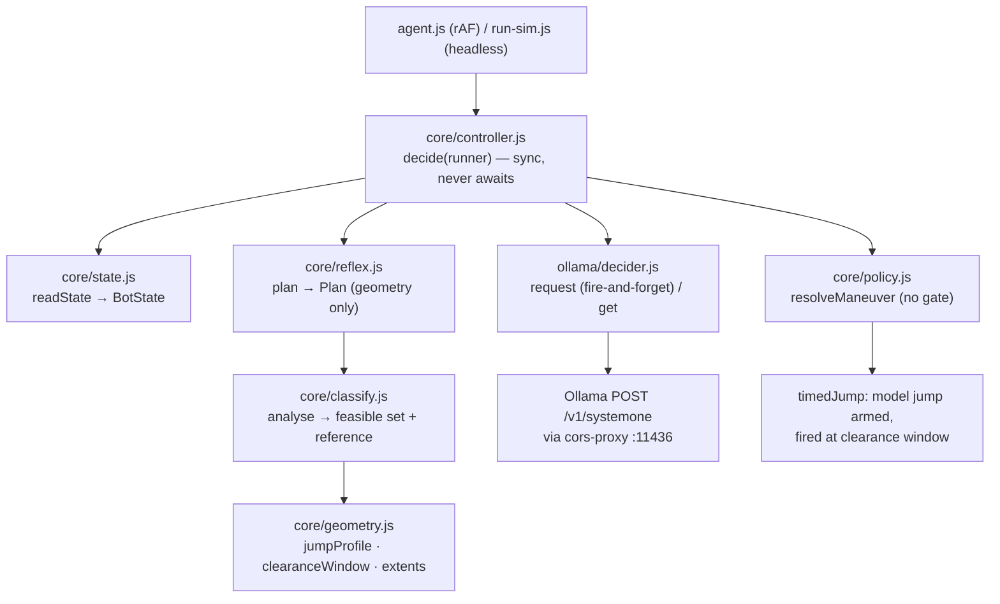
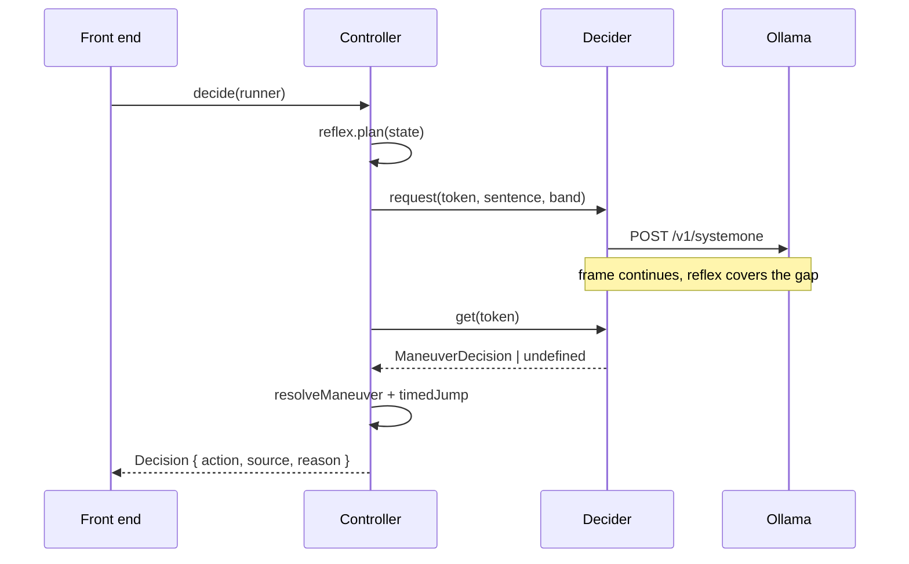

# decisaur

Bot for Chrome T-Rex Runner (`chrome://dino`) whose maneuver is chosen by a local
Ollama **System One** model (`tev1:0.8b`) over `POST /v1/systemone`.

Thesis, measured not asserted: **the model cannot improve the score.**
Geometry already determines the correct maneuver, so a perfect model ties reflex
and a real one dies.

```
reflex only     5/5 survived    score 5888    (no model)
--oracle        5/5 survived    score 5888    (perfect model, ~90% accuracy)
--model         0/5 survived    score ~700    (real tev1:0.8b, ~73%, dies on birds)
--adversarial   0/5 survived    score 13      (always wrong, always confident)
```

Same seeds, 20000 frames each. Every `--model` crash is a pterodactyl.

---

## Run

Requires Node 20.12+ and Ollama with the model pulled.

```sh
ollama pull tev1:0.8b
npm install
cp .env.example .env
npm run build
```

`.env` is required, has no fallbacks, and is **baked into the bundle at build
time** (`__DECISAUR_ENV__` define). Re-run `npm run build` after editing it.
Node CLIs read it at startup instead. Shell env wins over the file.

### Browser

`chrome://dino` blocks loopback fetch, and Ollama 403s `Origin: null`.
You need both fixes:

```sh
google-chrome --disable-features=LocalNetworkAccessChecks
npm run proxy   # 127.0.0.1:11436 -> 127.0.0.1:11434, drops Origin upstream
```

Then: open `chrome://dino` → <kbd>F12</kbd> Console →

```js
decisaurHost = 'http://127.0.0.1:11436';
```

→ paste one bundle from `dist/` → click the game → <kbd>Space</kbd>.

| Bundle | `useModel` | `useReflex` | Use for |
|---|---|---|---|
| `decisaur.user.js` (default) | ✓ | ✓ | normal play |
| `decisaur.model-only.user.js` | ✓ | ✗ | what the model does unaided |
| `decisaur.reflex-only.user.js` | ✗ | ✓ | A/B baseline, never queries |

```js
decisaur.stop()   // detach
decisaur.stats()  // counters + maneuver accuracy
decisaur.mode     // which build
```

HUD (bottom-left) shows model maneuver vs geometry reference, agreement,
accuracy, and round-trip latency. Disagreements turn red.

### Headless (no browser)

```sh
npm run sim                          # reflex only
npm run sim -- --oracle              # perfect model
npm run sim -- --adversarial         # confidently wrong model
npm run sim -- --model --fps 60      # real tev1:0.8b, paced like the game
npm run sim -- --frames 20000 --runs 5 --seed 900
npm run replay                       # maneuver accuracy vs geometry, 5 obstacles x 3 distances
```

`--fps 60` is mandatory with `--model`: unpaced, the loop ends in ms and no
query ever completes (looks like success, measures nothing).

Probes (each answers one "why"):

| Command | Question |
|---|---|
| `node src/node/probe-maneuver.js` | why one 3-way question can't work (6 framings) |
| `node src/node/probe-decompose.js` | why the question is split in two; variant **L** is production |
| `node src/node/probe-wording.js` | why the yPos-75 wording is load-bearing (4 wordings) |
| `node src/node/probe-latency.js` | latency vs question count |
| `npm run probe-perception` | obstacle shapes: classic / current Chromium / typeless |
| `node src/node/sweep-aim.js` | how `JUMP_AIM=0.54` was chosen |
| `npm run bench` | GPU throughput (says nothing about accuracy) |

---

## How it works

Three layers. Model decides **what**, geometry decides **when** and covers the
wait, policy decides whether the model may act (it may — nothing is gated).

| Layer | Answers | Latency | Source |
|---|---|---|---|
| Model (`src/ollama/decider.js`) | jump / bow / hold? | ~240–370ms | ~73% accurate |
| Geometry (`core/classify,geometry,reflex.js`) | when is a jump survivable? what until then? | ~0 / frame | exact |
| Policy (`core/policy.js`) | is the model allowed to act? | ~0 | ungated by design |



Per frame (`Controller.decide`, `controller.js:116`):

1. `readState` → `BotState` (defensive; game internals are not a public API).
2. `reflex.plan` → `Plan { action, analysis.preferred, centreDistance }`.
3. If target within `perceptionRange` (460px): `void decider.request(token, sentence, band)` — **not awaited**.
4. `decider.get(token)` → model answer or `undefined` → `resolveManeuver` → action.
5. `jump` (from either layer) fires only inside the clearance window via `jumpThreshold` + `JUMP_AIM=0.54`; otherwise `hold`. Bow while airborne is suppressed (game would slam + swallow it). One approach jumps once (`committed` set).



---

## LLM: the two-question trick

One `choice` over jump/bow/hold **fails** on `tev1:0.8b`: it latches onto
whichever option is worded strongest (`bow` unreachable at 0.14–0.37, or bows
everything at 0.75–0.89). Eleven framings are tabulated in `decider.js:13-31`.
Asking for the obstacle *class* is sharp (0.28–0.99 conf, 80%) but can't express
`hold`.

So the decision is split across two questions in **one forward pass**
(`QUESTIONS` in `src/ollama/decider.js:105`):

| Question | Type | Asks | Example |
|---|---|---|---|
| `clear` | `choice`: jump / bow | which maneuver clears it? | rules spelled out: cactus→jump, bird above→bow, bird at same height→jump |
| `urgent` | `noul` | act now or wait? | threshold 0.5 |
| → `maneuver` | derived | `hold` if not urgent, else `clear`'s pick | `hold` never competes for probability mass |

Prompt sent per query (`vocabulary.js`):

> `A man is running to the right. It is running along the ground. A bird is flying in the air, above the runner, close ahead of the runner.`

Three rules keep it honest:

- **Prose, not JSON.** Same scene as JSON: flat distribution, conf 0.08. As a sentence: clean argmax up to 0.99.
- **No answer in the prompt.** Only what's on screen (airborne?, raw `yPos`, distance in words). Never the collision extents `classify.js` scores against — otherwise accuracy measures an echo.
- **Every phrase needs exactly one rule.** The yPos-100 bird ("at the same height as the runner", extent 108–127, blocks stand *and* bow) matched neither of the first two rules, so the model guessed `bow` and ducked into a bird it had to jump. The third rule quotes the description verbatim — A/B: `bird_body@130` went 0/3 → 3/3 with no movement elsewhere.

### Timing: two queries per obstacle

A maneuver is a function of **distance**, not just shape: same bird wants `hold`
at 900px, `bow` at 130px. Dedup is per `(token, band)`:

- `far` band: entered at 460px (`DECISAUR_PERCEPTION_RANGE`).
- `near` band: re-asked at ≤300px (`NEAR_BAND_PX`, `controller.js:48`). At 13px/frame the ~240ms round trip is ~180px of travel — the latest a second answer can still land in the window.
- Max 1 in flight (`DECISAUR_MAX_CONCURRENT`); failed near-band re-query never overwrites a good far-band answer.

### Why there is no gate

`clear` reports confidence **0.000–0.054 on correct answers** (e.g. `bow 0.51 / jump 0.49`).
The argmax is right; the distribution is flat — the model can't say *how sure*
it is. Any confidence floor rejects everything including right answers, so
`resolveManeuver` (`policy.js:61`) applies none. Only non-opinions fall back to reflex:

- no answer yet (~600ms visibility vs ~240–370ms round trip → reflex owns most of every approach),
- query failed / `clear` named nothing usable.

`PolicyStats.scoreManeuver` scores every model answer against geometry **after**
acting on it — visible in HUD and `npm run replay`, never silent.

### What the model gets wrong

~73%, concentrated on birds: it can't reliably tell a bowable bird from a
jumpable one. The worst string: yPos-75 described as "head height" made the
model follow the jump rule correctly and die; "above the runner" fixed it
(`probe-wording.js`, 66.7% → 73.3% on `replay`).

---

## Code map

`controller.js` is DOM-free so browser and simulator drive the same object —
`sim.js` exercises the real pipeline, not a reimplementation.

| Path | Owns |
|---|---|
| `core/controller.js` | pipeline: `decide()` + `timedJump()` + `committed` + airborne-bow suppression |
| `core/state.js` | `readState` → `BotState`; `Tokeniser` (`token = type:yPos:counter`, rotates when `xPos` increases — objects are pooled/recycled) |
| `core/classify.js` | `analyse()`: feasible set + `preferred` (hold › bow › jump) from collision boxes, measured from ground stance |
| `core/geometry.js` | `jumpProfile` (mirrors game frame-for-frame), `clearanceWindow`, extents |
| `core/reflex.js` | 60Hz geometry net; `jumpThreshold()` also times model-chosen jumps |
| `core/policy.js` | `resolveManeuver()` (ungated) + `PolicyStats` scoring |
| `core/vocabulary.js` | `describeState()`: prose prompt, distance in words, no extents |
| `core/constants.js` | transcribed game physics with provenance |
| `ollama/decider.js` | System One client, `QUESTIONS` + `deriveManeuver()` + dedup/in-flight/failure policy |
| `browser/agent.js`, `keys.js`, `hud.js`, `entry.js`, `modes.js` | rAF loop + synthetic `keyCode` events + telemetry + `window.decisaur` + 3 compile-time modes |
| `node/sim.js`, `run-sim.js`, `replay.js`, `probe-*.js`, `bench-gpu.js` | headless game port + CLIs (oracle/adversarial are scripted deciders, near-band only) |
| `scripts/build.mjs` | esbuild IIFE per mode (`__DECISAUR_MODE__` + `__DECISAUR_ENV__` defines) → `dist/*.user.js` |
| `scripts/cors-proxy.mjs` | drops `Origin` upstream (that's what gets the `200`), adds `ACAO: *` back |

Feasibility cheat-sheet (`classify.js:16-22`):

| Obstacle | Extent (y) | Required |
|---|---|---|
| `CACTUS_LARGE` | 90–140 | jump |
| `CACTUS_SMALL` | 105–139 | jump |
| bird y=100 | 108–127 | jump (blocks stand and bow) |
| bird y=75 | 83–102 | bow |
| bird y=50 | 58–77 | hold (passes overhead) |

Config (`.env`, all required — missing key fails build, never defaults):

| Key | Default | Why |
|---|---|---|
| `DECISAUR_HOST` | `http://127.0.0.1:11434` | full URL (not `OLLAMA_HOST`, which is bare host+port for the proxy) |
| `DECISAUR_MODEL` | `tev1:0.8b` | System One decision head |
| `DECISAUR_KEEP_ALIVE` | `10m` | cold start costs ~300ms |
| `DECISAUR_PERCEPTION_RANGE` | `460` | ~590ms warning at top speed vs ~260ms round trip |
| `DECISAUR_MAX_CONCURRENT` | `1` | server serialises anyway |
| `DECISAUR_JUMP_AIM` | `0.54` | swept (`sweep-aim.js`), sharply peaked; late aim is fatal |

---

## Traps & limits

- Model deciding ⇒ doesn't survive (0/5 vs 5/5). Cost of an ungated 73% pilot.
- Jump timing is geometry in **all three builds** (even model-only) — `timedJump`, never fire-on-arrival (that died at frame 86).
- Current Chromium puts bird type on `typeConfig.type` (camelCase), not `Obstacle.type` — reading only `type` labelled every bird a cactus. `probe-perception.js` pins all three shapes.
- Game reads `String(e.keyCode)`; synthetic events must carry real `keyCode` (`keys.js` verifies, falls back to `defineProperty`, never sends 0).
- `Runner` is a lexical binding (not `window.Runner`); singleton behind `getInstance()` which can return null — `Agent.runner()` handles all three, don't simplify.
- Upstream typo `INIITAL_JUMP_VELOCITY` + a decoy `Runner.config.INITIAL_JUMP_VELOCITY=12` — `readJumpConstants()` takes the Trex config and both spellings.
- Ollama down ⇒ default build keeps playing on reflex; model-only does nothing (`model share 0%`).
